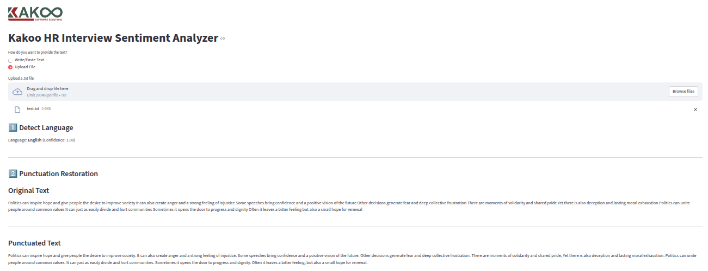
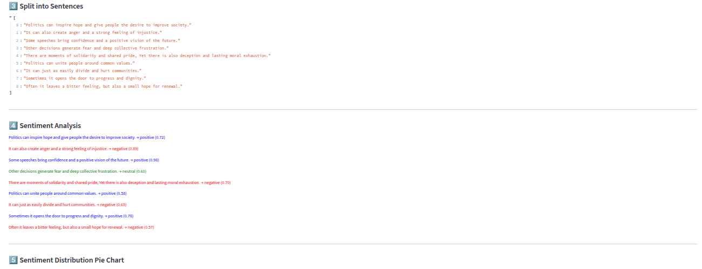

# Kakoo Sentiment Analyzer

## Overview

This project is a **Streamlit web application** designed to analyze sentiment of responses.  
The notebook **experiment.ipynb** explains in details. It performs the following tasks:

1. **Language Detection** – Automatically detects whether the input text is English, French, or another language using Mediapipe.  
2. **Punctuation Restoration** – Corrects missing or incorrect punctuation in unpunctuated or poorly punctuated text using a deep learning model (`deepmultilingualpunctuation`).  
3. **Sentence Splitting** – Breaks the paragraph into individual sentences for more accurate analysis.  
4. **Sentiment Analysis** – Assigns each sentence a sentiment label: **positive**, **neutral**, or **negative**, and calculates confidence scores using a lightweight multilingual model.  
5. **Visualization** – Displays a pie chart showing the distribution of sentiments across all sentences.  

The app can handle text input **either typed directly** or **uploaded as a file**.

---

## Lightweight & Efficient Sentiment Model

To ensure smooth deployment on **Streamlit Cloud** (2.7 GB limit), this project uses a **lightweight multilingual sentiment model** instead of the large 2.1 GB model:

Demo App can be visited here: **[Kakoo Sentiment App](https://sent-kakoo.streamlit.app)**

- Original large model (not used here):  
```
sentiment_model = pipeline(
    "sentiment-analysis", 
    model="cardiffnlp/twitter-xlm-roberta-base-sentiment")
```

Lightweight multilingual model (used here):
```sentiment_model = pipeline(
    "sentiment-analysis",
    model="clapAI/mmBERT-small-multilingual-sentiment")
```

This smaller model still provides accurate sentiment classification for English and French, while being cloud-friendly.


Running Locally
To run the app on your local machine:

Clone the repository:

git clone https://github.com/your-username/kakoo-project.git

cd kakoo-project

pip install --upgrade pip

pip install -r requirements.txt

Run the Streamlit app:


streamlit run new_sent.py







